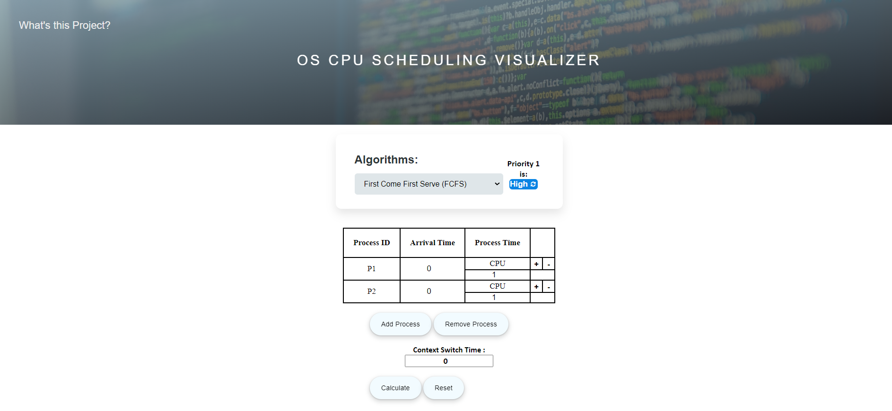
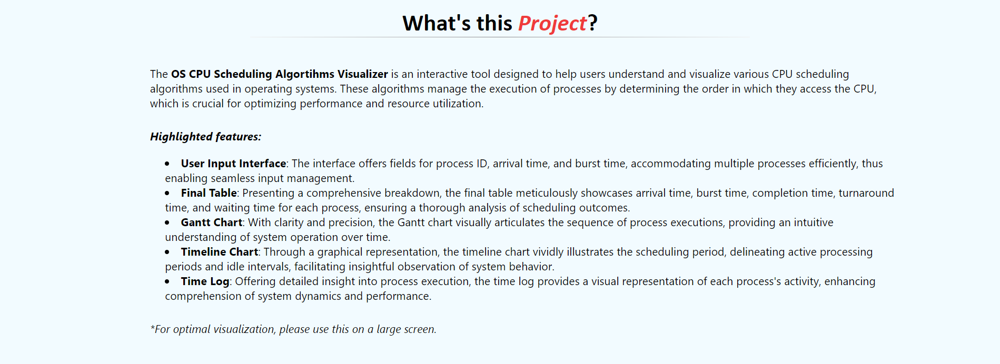

# Sorting Visualizer

The OS CPU Scheduling Algortihms Visualizer is an interactive tool designed to help users understand and visualize various CPU scheduling algorithms used in operating systems. These algorithms manage the execution of processes by determining the order in which they access the CPU, which is crucial for optimizing performance and resource utilization.

## Screenshot

## Features
- User Input Interface: Efficiently manage multiple processes with fields for process ID, arrival time, and burst time.
- Final Table: Provides a detailed breakdown of scheduling outcomes, including arrival time, burst time, completion time, turnaround time, and waiting time for each process.
- Gantt Chart: Visualizes the sequence of process executions, offering clarity and precision in understanding system operation over time.
- Timeline Chart: Illustrates the scheduling period graphically, distinguishing between active processing periods and idle intervals for insightful observation of system behavior.
- Time Log: Detailed visual representation of process execution, enhancing comprehension of system dynamics and performance.

## Nine Scheduling Algorithms: 
- First Come First Serve (FCFS)
- Shortest Job First (SJF)
- Longest Job First (LJF) 
- Shortest Remaining Job First (SRTF)
- Longest Remaining Job First (LRTF)
- Round Robin
- Priority (Non Preemptive)
- Priority (Preemptive)
- Highest Response Ratio Next (HRRN)

## How to Use:

- Clone this repository to your local machine.
- Open the index.html file in your web browser.
- Choose a Scheduling algorithm from the dropdown menu.
- Enter the details of each process.
- Click the "Calculate" button to see everything related to algorithm in action.

